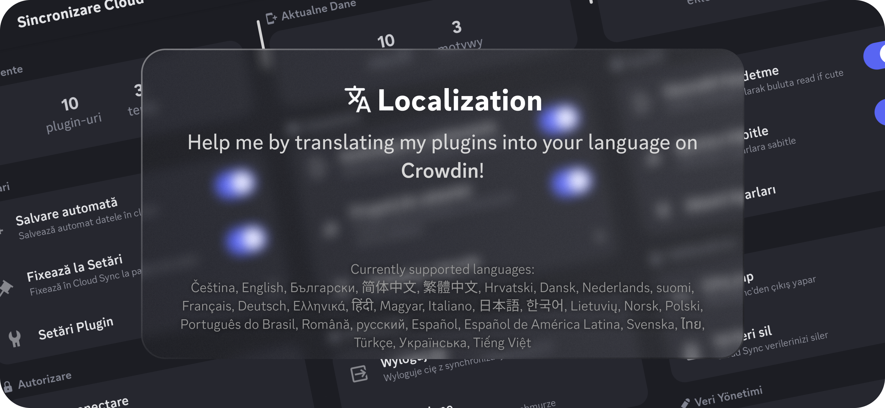

<!--
    * This file was autogenerated, do not modify it directly
    * https://github.com/nexpid/BunnyPlugins/tree/dev/scripts/build/modules/readmes.ts
-->

<h1 align="center">🐇 Bunny Plugins</h1>

A collection of all my awesome plugins for <a href="https://github.com/pyoncord/Bunny#installing">Bunny</a>.

> [!IMPORTANT]  
> My plugins assume you're using version atleast **211.10** (211210) from **January 1st 2023**, they might not work properly if you use an older version than that.

> [!CAUTION]  
> If you have any plugins that are installed under the **dev.bunny.nexpid.xyz** subdomain, make sure to reinstall them under **bunny.nexpid.xyz**, as the dev subdomain is being sunsetted.

## 🌐 Localization

## 📊 Stats

- I've coded a total of **19** plugins
- I finished **14** plugins, and I'm working on **4** plugins
- **1** of my plugins is discontinued.

## 📃 Plugin List

### ✅ Finished

- Char Counter — Adds a character counter above the chat input
  -  
- Clean URLs — Removes tracking garbage from links you send and receive
  -  
- Cloud Sync — Syncs your plugins, themes and fonts to the cloud
  -   
- DOOM — Play DOOM inside of Discord by going to the Settings (powered by js-dos)
  -  
- Kazum Kiryu Facecam — Have Kazum Kiryu accompany you while you type. Don't worry, he doesn't bite!
  -  
- Local Pins — Adds a button to locally pin a message
  -  
- Message Preview — Adds a button to preview your message before sending it
  -  
- Monet Theme — A material you theme generator
  -  
- Plugin Browser — Browse all proxied plugins
  -  
- Plugin Embeds — Shows an embed with plugin info when a plugin link is sent in chat
  -  
- Song Spotlight — Show off songs on your Discord profile!
  -   
- Twemoji Everywhere — Turns all (possible) system emoji into Twemoji 👋😀🎉
  -  
- Use System Emoji — Replaces Twemoji with system emoji in messages
  -  
- UserPFP — https://userpfp.github.io/UserPFP/#using-userpfp
  -  

### ❌ Unfinished

- App Directory — Brings the app directory to mobile
  -  
- CustomRPC — Displays a custom RPC activity on your profile! (idea from Vencord) (RECODED)
  -  
- NexxUtils — Nexx's utility plugins
  -  
- Themes+ — Adds more customizability to Themes
  -  

### 🎫 Discontinued

- Tenor Gif Fix — Download and share Tenor links as GIFs instead of MP4s (thanks to rosie <3)
  - **Discontinued due to:** Temporarily replaced by NexxUtils
  -  

## 📜 Licensing

This project now uses the CC-BY-4.0 license

The Creative Commons Attribution 4.0 International License is an open and flexible license that grants users the ability to share, adapt, and build upon the contents of this project for any purpose, including commercial endeavors. Under this license, users are required to provide appropriate attribution to the original author(s), acknowledging their contribution to the work. This license promotes collaboration and innovation by allowing individuals and organizations to leverage and modify the project while ensuring that credit is given to the creators.

