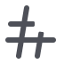
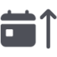

# Themeable custom icons

## Prerequisites

- Themes+ iconpack repo

## Intro

Go into Themes+'s settings > Configure > Mode = Manual > Custom iconpack. Then, fill in the **URL** and **Filename Suffix** of your iconpack.

## Common icons

Common icons are stored in the `<iconpack root>/_/` folder.

-  — `bunny.png`
-  — `revenge.png`

## Plugin icons

Icons used by plugins are stored in the `<iconpack root>/_/external/` folder. Here's an autogenerated list of all of them:

<!-- icons hook start -->

### MonetTheme

-  — `MonetTheme/RepainterIcon.png`

### ColorfulChannels

-  — `ColorfulChannels/announcement/lock.png`
-  — `ColorfulChannels/announcement/warning.png`
-  — `ColorfulChannels/forum/lock.png`
-  — `ColorfulChannels/forum/warning.png`
-  — `ColorfulChannels/image/lock.png`
-  — `ColorfulChannels/image/warning.png`
-  — `ColorfulChannels/lock.png`
-  — `ColorfulChannels/lockBottom.png`
-  — `ColorfulChannels/stage/lock.png`
-  — `ColorfulChannels/text/lock.png`
-  — `ColorfulChannels/text/warning.png`
-  — `ColorfulChannels/voice/both.png`
-  — `ColorfulChannels/warning.png`
-  — `ColorfulChannels/warningBottom.png`

### Minimod

-  — `Minimod/NerdEmoji.png`

### SpotifyListenAlong

-  — `SpotifyListenAlong/UserPlayIcon.png`

### PluginBrowser

-  — `PluginBrowser/SortDateNewestIcon.png`
-  — `PluginBrowser/SortDateOldestIcon.png`
-  — `PluginBrowser/SortNameAZIcon.png`
-  — `PluginBrowser/SortNameZAIcon.png`

<!-- icons hook end -->
